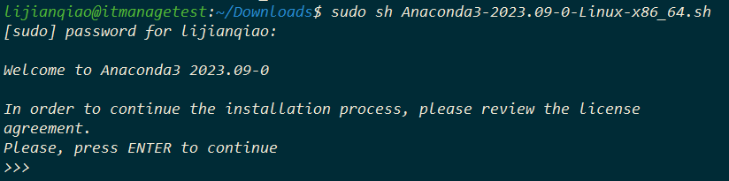
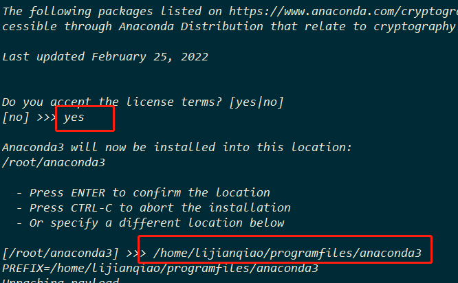
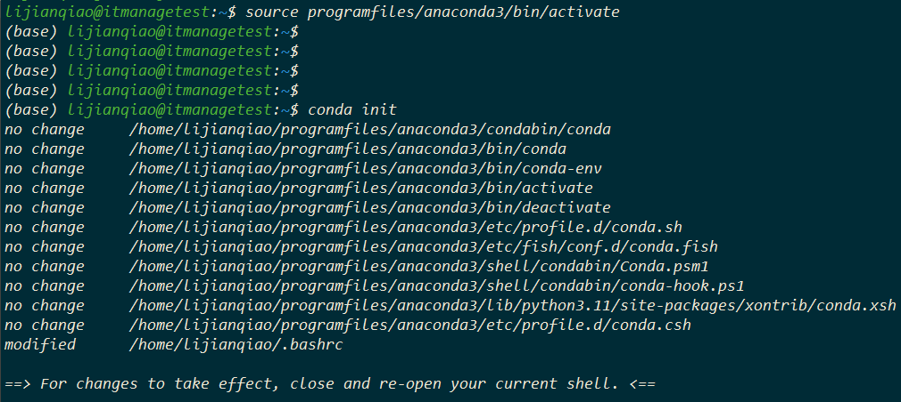

# Ubuntu 搭建 Django项目
使用Ubuntu服务器，搭建django项目,使用软件、库
```textmate
Ubuntu 22.04.3
Django 4.2.7
Nginx 1.18.0
supervisord 4.2.1
redis 6.0.16
anaconda 23.7.4
python 3.11
mysql 8.0.35
logrotate 3.19.0
celery 5.3.4 
daphne 4.0.0
streamlit 1.29.0
```

## 1.Ubuntu系统安装
```text
系统安装省略
系统更新源省略
系统更新省略 sudo apt update
创建项目路径 sudo mkdir /projects
创建anaconda安装文件路径 sudo mkdir ~/programfiles
<记得给权限 sudo chown -R <>:<> 路径>
```
## 2. anaconda安装
1. 下载
```text
官网下载：https://www.anaconda.com/download
下载文件例如放到 ~/Downloads/Anaconda3-2023.09-0-Linux-x86_64.sh
```
2. 安装
```bash
cd ~/Downloads/
sudo sh Anaconda3-2023.09-0-Linux-x86_64.sh
```
#### 输入回车

#### 配置路径

#### 初始化conda

3. 配置anaconda
* 如果没有执行 conda 初始化，可以执行一下命令, 执行完上述指令后，也会在 `~/.bashrc` 末尾添加上述代码
```bash
source programfiles/anaconda3/bin/activate
```

* anaconda 换源已经envs路径和pkgs路径
1. [x] 创建或编辑 ~/.condarc 文件
```bash
sudo vim ~/.condarc
# 如果没有vim，请安装 sudo apt install vim -y
```
2. [x] 添加下面的代码
```textmate
auto_activate_base: false
envs_dirs:
  - /home/lijianqiao/programfiles/data/envs/
pkgs_dirs:
  - /home/lijianqiao/programfiles/data/pkgs/
channels:
  - https://mirrors.tuna.tsinghua.edu.cn/anaconda/cloud/msys2/
  - https://mirrors.tuna.tsinghua.edu.cn/anaconda/cloud/conda-forge
  - https://mirrors.tuna.tsinghua.edu.cn/anaconda/pkgs/free/
  - https://mirrors.tuna.tsinghua.edu.cn/anaconda/cloud/pytorch/
  - https://mirrors.tuna.tsinghua.edu.cn/anaconda/pkgs/main/
  - defaults
show_channel_urls: true
```
3. [x] 查看源: 只要出现channel URLS 是按照上面配置的即可 即可
```bash
conda info
```
4. [x] 创建、进入、退出环境
```bash
conda create --name ITmanage python=3.11
# conda create --name 环境名 包名（多个包名用空格分隔）

# 创建完成之后进入环境,进入之后，会有(ITmanage) lijianqiao@itmanagetest:~$的标志
conda activate ITmanage

# 退出环境
conda deactivate
```
## 3. 更新pip源
```bash
# 在 ~ 目录下创建.pip目录, 进入创建pip.conf文件, 写入内容实现永久换源
cd ~
sudo mkdir .pip
cd .pip
sudo vim pip.conf
# 写入下面代码后保存
[global]
index-url = https://pypi.douban.com/simple
[install]
use-mirrors =true
mirrors =https://pypi.douban.com/simple/
trusted-host =pypi.douban.com

# 升级pip，切换到conda环境升级
conda activate ITmanage
pip install --upgrade pip
```
## 4. 安装配置mysql
```bash
# 安装
sudo apt install mysql-server -y

# 配置mysql
sudo mysql
use mysql;

# 查看当前用户、主机配置
select host,user from user;
#+-----------+------------------+
#| host      | user             |
#+-----------+------------------+
#| localhost | debian-sys-maint |
#| localhost | mysql.infoschema |
#| localhost | mysql.session    |
#| localhost | mysql.sys        |
#| localhost | root             |
#+-----------+------------------+
#6 rows in set (0.00 sec)

# 创建一个lijianqiao的账户，在任何电脑都可以登录，并设置密码为123；
create user 'lijianqiao'@'%' identified by '123';
# 给lijianqiao账户授权，当前给所有数据库的权限
grant all privileges on *.* to 'lijianqiao'@'%';
# 刷新mysql权限表
flush privileges;
# 退出mysql
exit()

# 修改mysql的配置文件
sudo vim /etc/mysql/mysql.conf.d/mysqld.cnf
# 注销掉下面，也可以根据你的设置进行
# bind-address = 127.0.0.1
# mysqlx-bind-address = 127.0.0.1

# 现在即可远程连接
# 如果使用DBeaver不能连接，出现Public Key Retrieval is not allowed错误，需要把驱动属性中的allowPublicKeyRetrieval=false改为true
# 允许防火墙
sudo ufw allow mysql
```
## 5. 配置项目
```bash
# 拷贝项目文件到，我是放在/projects/ITmanage，项目名为ITmanage
# 进入项目目录 cd ITmanage ,根据requirements.txt来安装库
# 本项目需要安装一下库
pip install django==4.2.7 pyecharts==2.0.4 django-import-export==3.3.1 django-simpleui==2023.11.16 django-session-timeout==0.1.0 pandas==2.1.2 channels==4.0.0 celery==5.3.4 daphne==4.0.0 django-celery-beat==2.5.0 django-celery-results==2.5.1 django-redis==5.4.0 eventlet==0.33.3 flower==2.0.1 paramiko==3.3.1 Pillow==10.1.0 pysnmp==4.4.12 qrcode==7.4.2 redis==4.6.0 tablib==3.5.0 streamlit==1.29.0 matplotlib seaborn ydata_profiling streamlit_ydata_profiling sweetviz reportlab statsmodels plotly pygwalker
# 安装完成之后需要把pyasn1库降级到0.4.8，不然会发生报错，pip install pyasn1==0.4.8
# 在安装pip install mysqlclient的时候出现2次报错：
# /bin/sh: 1: pkg-config: not found
# /bin/sh: 1: pkg-config: not found
# Exception: Can not find valid pkg-config name.

# error: command 'gcc' failed: No such file or directory
sudo apt-get install pkg-config libmysqlclient-dev gcc -y # 安装即可解决
# 生成数据库文件，需要到你的项目路径下
cd /projects/ITmanage
python manage.py makemigrations
# 迁移数据库
python manage.py migrate
# 生成静态文件，执行下面之后选择yes
python manage.py collectstatic

# 因我项目用到了端口8050，则需要在防火墙放行该端口
sudo ufw allow 8050
```
## 6. 安装配置nginx
```bash
# 安装nginx
sudo apt install nginx -y
# 修改nginx主配置文件用户
sudo vim /etc/nginx/nginx.conf
# 首行的用户换成你有权限的用户，我使用的是：user lijianqiao; 需要确保该用户有访问项目目录中的static和media目录755权限
# 包括给/var/log/nginx文件夹的权限，下面是我当前用户给的权限
sudo chown -R lijianqiao:lijianqiao /var/log/nginx
# 创建一个新的nginx配置文件，先备份原来默认的
sudo cp /etc/nginx/sites-enabled/default /etc/nginx/sites-enabled/default.bak
sudo vim /etc/nginx/sites-enabled/default
# 清空原来的所有，写入下面代码
server {
        listen 80;
        # 最大上传文件大小
        client_max_body_size 64m;
        charset utf-8;
        server_name www.itmanage.lijianqiao.cn;

        location / {
                proxy_pass http://0.0.0.0:8050;
                proxy_http_version 1.1;
                proxy_set_header Upgrade $http_upgrade;
                proxy_set_header Connection "upgrade";
                proxy_set_header Host $host;
                proxy_set_header X-Real-IP $remote_addr;
                proxy_set_header X-Forwarded-For $proxy_add_x_forwarded_for;
                proxy_set_header X-Forwarded-Proto $scheme;
                proxy_set_header X-Forwarded-Host $server_name;
        }

        # 静态文件（对应你的django下settings.py的目录）
        location /static/ {
                alias /projects/ITmanage/static/;   # 后面要加/，我可能因为项目中写的是路径有点出入，所以在这里没加/导致静态文件不能加载
        }
        # 动态上传文件（对应你的django下settings.py的目录）
        location /media/ {
                alias /projects/ITmanage/media/;
        }
}
# 确保你django项目目录下的settings.py是如下配置：
# # 配置媒体文件路径
#MEDIA_ROOT = os.path.join(BASE_DIR, 'media')
#MEDIA_URL = '/media/'
#STATIC_URL = "static/"
#STATIC_ROOT = os.path.join(BASE_DIR, 'static')

# 测试nginx配置文件是否正确, 显示ok和successful就是没问题
sudo nginx -t
# 重载nginx并查看状态，确定是active (running)
sudo systemctl reload nginx
sudo systemctl status nginx
# 加入开机启动
sudo systemctl enable nginx
# 允许防火墙
sudo ufw allow 'Nginx Full'
```
## 7. 安装配置supervisor
是用于daphne、Celery-beat、Celery-worker的进程守护（项目中需要用到）
```bash
# 安装supervisor
sudo apt install supervisor -y
# 创建保存一个你项目需要用到的supervisor配置文件
sudo vim /etc/supervisor/conf.d/ITmanage.conf
[program:ITmanage]
command=/home/lijianqiao/programfiles/data/envs/ITmanage/bin/daphne -b 0.0.0.0 -p 8050 ITmanage.asgi:application
directory=/projects/ITmanage
user=lijianqiao
autostart=true
autorestart=true
stderr_logfile=/projects/ITmanage/logs/supervisor/itmanage.err.log
stdout_logfile=/projects/ITmanage/logs/supervisor/itmanage.out.log
# 如果你不知道你的daphne在哪儿，你要切换到你的anaconda的python环境中，使用which daphne，后面的celery-beat、celery-worker、celery-flower一样使用which

# 创建一个supervisor项目日志路径
sudo mkdir /projects/ITmanage/logs/supervisor

# 重新加载并启动程序
sudo supervisorctl reread
sudo supervisorctl update
sudo supervisorctl start ITmanage # 如果报错ITmanage: ERROR (already started)，则说明已经启动，可以用restart

# 查看supervisor日志是否出错，以下一切正常
sudo cat logs/supervisor/itmanage.err.log
#2023-12-12 14:56:27,741 INFO     Starting server at tcp:port=8050:interface=0.0.0.0
#2023-12-12 14:56:27,742 INFO     HTTP/2 support not enabled (install the http2 and tls Twisted extras)
#2023-12-12 14:56:27,742 INFO     Configuring endpoint tcp:port=8050:interface=0.0.0.0
#2023-12-12 14:56:27,742 INFO     Listening on TCP address 0.0.0.0:8050
#2023-12-12 14:57:07,339 INFO     Killed 0 pending application instances
#2023-12-12 14:57:08,908 INFO     Starting server at tcp:port=8050:interface=0.0.0.0
#2023-12-12 14:57:08,908 INFO     HTTP/2 support not enabled (install the http2 and tls Twisted extras)
#2023-12-12 14:57:08,908 INFO     Configuring endpoint tcp:port=8050:interface=0.0.0.0
#2023-12-12 14:57:08,909 INFO     Listening on TCP address 0.0.0.0:8050

# 配置Celery worker、Celery beat 和 Celery Flower 的supervisor配置文件
sudo vim /etc/supervisor/conf.d/celery_worker.conf
[program:celery_worker]
command=/home/lijianqiao/programfiles/data/envs/ITmanage/bin/celery -A ITmanage worker -l info -P eventlet --logfile=/projects/ITmanage/logs/celery_worker.log
directory=/projects/ITmanage
user=lijianqiao
autostart=true
autorestart=true

sudo vim /etc/supervisor/conf.d/celery_beat.conf
[program:celery_beat]
command=/home/lijianqiao/programfiles/data/envs/ITmanage/bin/celery -A ITmanage beat -l info --logfile=/projects/ITmanage/logs/celery_beat.log
directory=/projects/ITmanage
user=lijianqiao
autostart=true
autorestart=true

sudo vim /etc/supervisor/conf.d/celery_flower.conf
[program:celery_flower]
command=/home/lijianqiao/programfiles/data/envs/ITmanage/bin/celery -A ITmanage flower --address=10.11.19.14 --port=5555 --basic_auth=admin:123
directory=/projects/ITmanage
user=lijianqiao
autostart=true
autorestart=true

# 配置streamlit 的supervisor配置文件
sudo vim /etc/supervisor/conf.d/st.conf
[program:st]
command=/home/lijianqiao/programfiles/data/envs/ITmanage/bin/streamlit run streamlit/st.py --server.port 8051 --server.address 10.11.19.14 --server.enableXsrfProtection=false
directory=/projects/ITmanage
user=lijianqiao
autostart=true
autorestart=true
stderr_logfile=/projects/ITmanage/logs/supervisor/itmanage_st.err.log
stdout_logfile=/projects/ITmanage/logs/supervisor/itmanage_st.out.log

sudo supervisorctl reread
sudo supervisorctl update
sudo supervisorctl restart celery_worker
sudo supervisorctl restart celery_beat
sudo supervisorctl restart celery_flower
sudo supervisorctl restart st
# 查看状态
sudo supervisorctl status
```
## 8. 使用logrotate 管理日志文件
```bash
# 安装logrotate
sudo apt install logrotate
# 给项目创建一个专门的logrotate 配置文件
sudo vim /etc/logrotate.d/itmanage
# 写入下面代码，注意注释的问题，如果在每行的后面添加 # <注释内容>，可能会告警
/projects/ITmanage/logs/*.log {
    daily
    rotate 7         
    missingok         
    notifempty         
    compress            
    delaycompress       
    create 640 lijianqiao lijianqiao  
    postrotate          
        sudo supervisorctl restart celery_beat
        sudo supervisorctl restart celery_worker
        sudo supervisorctl restart celery_flower
    endscript
}
/projects/ITmanage/logs/supervisor/*.log {
    daily            
    rotate 7            
    missingok          
    notifempty        
    compress             
    delaycompress        
    create 640 lijianqiao lijianqiao  
    postrotate          
        sudo supervisorctl restart ITmanage
    endscript
}
# 上面说明：
#/projects/ITmanage/logs/*.log {
#    daily                # 每天轮换日志
#    rotate 7             # 保留 7 个归档日志
#    missingok            # 如果日志丢失，不报错继续
#    notifempty           # 如果日志为空，不轮换
#    compress             # 使用 gzip 压缩日志文件
#    delaycompress        # 延迟压缩到下一次轮换周期
#    create 640 lijianqiao lijianqiao  # 创建新的空日志文件，设置权限和所有者
#    postrotate           # 轮换后需要执行的命令
#        # 重启相关的服务来应用日志轮换
#        # 例如，如果您使用 Supervisor 管理 Celery，可以重启 Celery 进程
#        supervisorctl restart itmanage
#    endscript
#}

# 测试配置
sudo logrotate --debug /etc/logrotate.d/itmanage
```
## 9. 安装配置redis
因为我的周期性任务用到了redis，所以需要配置
```bash
# 安装redis
sudo apt install redis-server -y
# 配置redis密码，Redis 的配置文件通常位于/etc/redis/redis.conf
sudo vim /etc/redis/redis.conf
# 在文件中找到 # requirepass foobared, 取消#，后面并设置你的密码，例如我设置密码是root，如下
requirepass root
# 重启redis
sudo systemctl restart redis
# 防火墙放行redis
sudo ufw allow redis
# 开机启动redis
sudo systemctl enable redis-server
# 验证redis, 以下就是证明你redis配置成功
redis-cli
127.0.0.1:6379> ping
(error) NOAUTH Authentication required.
127.0.0.1:6379> auth root
OK
127.0.0.1:6379> ping
PONG
127.0.0.1:6379> exit
```
## 10. 安装node.js
知识库wiki集成需要用到
## 11. 问题集
```textmate
问题1：
django访问地址遇到的 "禁止访问 (403) CSRF验证失败" 错误
解决方案：
在django项目文件settings.py中设置 CSRF_TRUSTED_ORIGINS = ['http://www.itmanage.lijianqiao.cn'] ，并重启 sudo supervisorctl restart ITmanage
```

